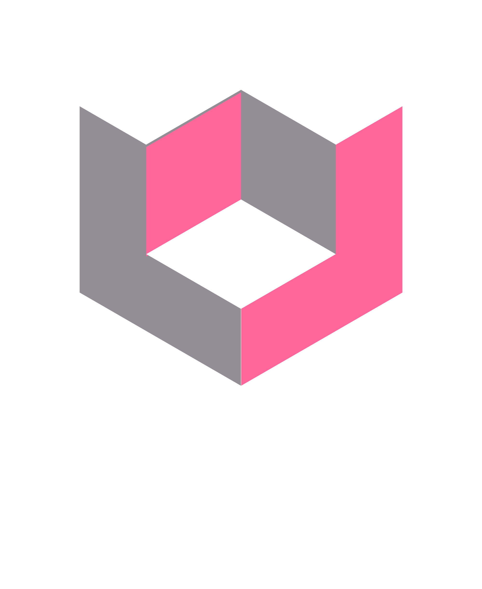

<center>


# (NexChat) AI Chatbot with Multimodal Capabilities

</center>

## Project Description

This project delivers an AI-powered chatbot with versatile capabilities, including document-based question answering and summarization, image captioning, and audio interaction.

## Tasks

-   **Question Answering:** Powered by RAG using `gemini-flash-1.5` as the LLM, `BAAI/bge-small-en-v1.5` as the embedding model, and Faiss as the vector store.
-   **Summarization:** Utilizes `facebook/bart-large-cnn` for document summarization.
-   **Image Captioning:** Employs `blip-image-captioning-base` for generating captions from images.
-   **Text-to-Speech (TTS):** Uses `gTTS` to convert text responses into spoken audio.
-   **Speech Recognition:** Implements Google's `speech_recognition` library for converting audio prompts into text.

## Methodology (Tech Stack)

-   **Programming Language:** Python 3.11.\*
-   **Frameworks and Libraries:**
    -   Streamlit for the UI
    -   LangChain for retrieval-augmented generation
    -   Transformers (Hugging Face) for NLP and multimodal tasks
    -   Faiss for vector storage and retrieval
    -   gTTS for text-to-speech
    -   SpeechRecognition for audio-to-text processing

## Project File Structure

```
Project - AI-Powered Chatbot ST/
├── data/
│   ├── test_data...
├── imgs/
│   ├── logos_and_screenshots...
├── src/
│   ├── audio/
│   │   ├── __init__.py
│   │   ├── audio_input.py
│   │   ├── audio_output.py
│   ├── cv/
│   │   ├── __init__.py
│   │   ├── image_captioning.py
│   ├── nlp/
│   │   ├── __init__.py
│   │   ├── RAG.py
│   │   ├── summarization.py
│   ├── app.py
│   ├── utils.py
├── .env
├── .gitignore
├── README.md
├── requirements.txt
```

## Setup and Usage

### Installation

1. Clone the repository:
    ```bash
    git clone https://gitlab.com/begad-tamim/ai-powered-chatbot.git
    cd ai-powered-chatbot
    ```
2. Install Python dependencies:
    ```bash
    pip install -r requirements.txt
    ```

### Configuration

-   Add API keys for external services in a `.env` file:
    ```
    GEMINI_API_KEY=your_key_here
    HUGGINGFACE_API_KEY=your_key_here
    ```

### Running the Application

1. Start the chatbot:
    ```bash
    streamlit run src/app.py
    ```
2. For audio support, ensure microphone and speaker permissions are enabled.

## Demo Screenshots

### Question Answering


### Summarization


### Image Captioning


## Used Resources

-   **Hugging Face Transformers Documentation:** [https://huggingface.co/docs/transformers](https://huggingface.co/docs/transformers)
-   **LangChain Documentation:** [https://docs.langchain.com](https://docs.langchain.com)
-   **Streamlit Documentation:** [https://docs.streamlit.io](https://docs.streamlit.io)

## Conclusion

This project integrates state-of-the-art NLP and computer vision models into an interactive chatbot with RAG and audio capabilities, handling multimodal tasks and user interactions. It aligns with the course content of 'Selected Topics in AI,' demonstrating practical AI applications.
