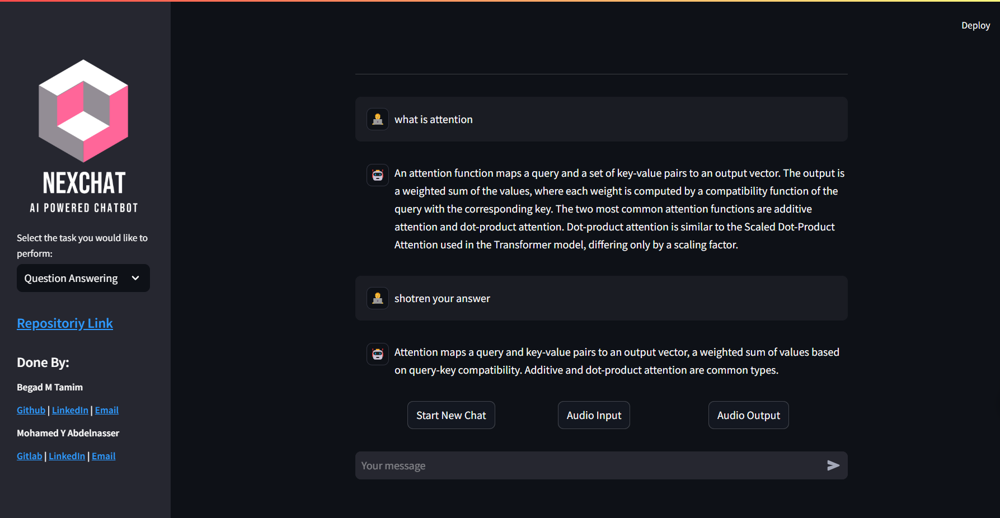
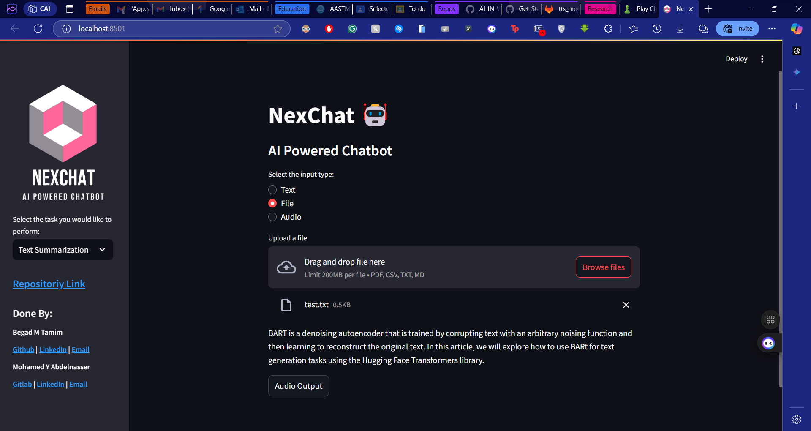
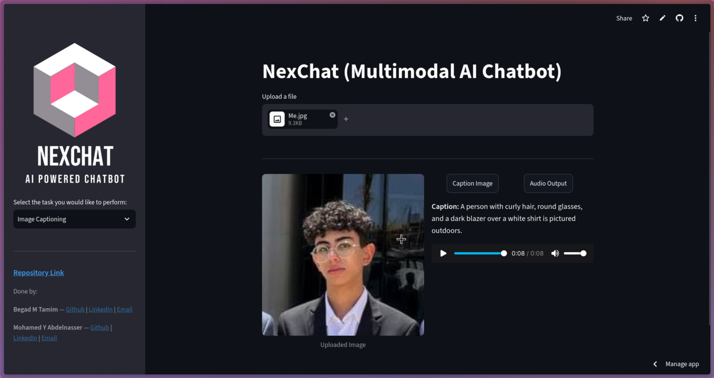

# (NexChat) AI Chatbot with Multimodal Capabilities

## Project Description

This project delivers an AI-powered chatbot with versatile capabilities, including document-based question answering and summarization, image captioning, and audio interaction.

## Tasks

-   **Question Answering:** Powered by RAG using `glm-4.7-flash` (Z.ai) as the LLM, hosted HuggingFace embeddings (`BAAI/bge-small-en-v1.5`) as the embedding model — no local embedding model, no torch dependency — and Faiss as the vector store.
-   **Summarization:** Utilizes `facebook/bart-large-cnn` for document summarization.
-   **Image Captioning:** Employs `blip-image-captioning-base` for generating captions from images.
-   **Text-to-Speech (TTS):** Uses `gTTS` to convert text responses into spoken audio, played back in the browser through `st.audio`.
-   **Speech Recognition:** Recordings are captured in the browser with Streamlit's `st.audio_input` widget and transcribed with Google's `speech_recognition` library — no server-side audio device access.

## Methodology (Tech Stack)

-   **Programming Language:** Python 3.11.\*
-   **Frameworks and Libraries:**
    -   Streamlit for the UI
    -   LangChain for retrieval-augmented generation
    -   GLM-4.7-Flash (Z.ai, OpenAI-compatible) for chat via `langchain-openai`
    -   HuggingFace Inference API (hosted) for embeddings (via `langchain-huggingface`), summarization, and image captioning
    -   Faiss for vector storage and retrieval
    -   gTTS for text-to-speech
    -   SpeechRecognition for audio-to-text processing

## Project File Structure

```
NexChat/
├── data/
│   ├── test_data...
├── imgs/
│   ├── logos_and_screenshots...
├── src/
│   ├── audio/
│   │   ├── __init__.py
│   │   ├── audio_input.py
│   │   ├── audio_output.py
│   ├── cv/
│   │   ├── __init__.py
│   │   ├── image_captioning.py
│   ├── nlp/
│   │   ├── __init__.py
│   │   ├── RAG.py
│   │   ├── summarization.py
│   │   ├── vector_cache.py
│   ├── app.py
│   ├── credentials.py
│   ├── paths.py
│   ├── utils.py
├── tests/
│   ├── __init__.py
│   ├── test_audio_input.py
│   ├── test_audio_output.py
│   ├── test_credentials.py
│   ├── test_image_captioning.py
│   ├── test_paths.py
│   ├── test_rag.py
│   ├── test_smoke.py
│   ├── test_summarization.py
│   ├── test_utils.py
│   ├── test_vector_cache.py
├── .env                  # optional, local development only
├── .gitignore
├── conftest.py
├── packages.txt          # empty — no system packages needed
├── README.md
├── requirements.txt
├── requirements-dev.txt
```

## Setup and Usage

### Installation

1. Clone the repository:
    ```bash
    git clone https://github.com/Momad-Y/NexChat.git
    cd NexChat
    ```
2. Install Python dependencies:
    ```bash
    pip install -r requirements.txt
    ```

### Configuration (BYOK)

NexChat is bring-your-own-key. There is nothing to configure before running it:
enter your **GLM (Z.ai)** and **HuggingFace** API keys directly in the app's sidebar at
runtime. Keys live only in your Streamlit session, are never written to disk, and
are never shared between users — so the same deployed instance can serve everyone
with their own keys.

-   **Optional, local development only:** a `.env` file at the repository root
    auto-fills those sidebar fields so you don't have to retype your keys on every
    restart. It is a convenience for your own machine — end users and deployed
    instances do not need one.
    ```
    GLM_API_KEY=your_key_here
    HUGGINGFACE_API_KEY=your_key_here
    ```

### Running the Application

1. Start the chatbot:
    ```bash
    streamlit run src/app.py
    ```
2. Enter your GLM (Z.ai) and HuggingFace API keys in the sidebar.
3. Audio is fully browser-based: recording goes through the browser's microphone via
   Streamlit's `st.audio_input` widget (your browser will ask for microphone access)
   and playback happens in the browser via `st.audio`. The server never touches an
   audio device, so this works identically locally and when deployed.

## Demo Screenshots

### Question Answering



### Summarization



### Image Captioning



## Used Resources

-   **Hugging Face Inference Providers Documentation:** [https://huggingface.co/docs/inference-providers](https://huggingface.co/docs/inference-providers)
-   **Z.ai GLM API Documentation:** [https://docs.z.ai/guides/overview/quick-start](https://docs.z.ai/guides/overview/quick-start)
-   **LangChain Documentation:** [https://docs.langchain.com](https://docs.langchain.com)
-   **Streamlit Documentation:** [https://docs.streamlit.io](https://docs.streamlit.io)

## Conclusion

This project integrates state-of-the-art NLP and computer vision models into an interactive chatbot with RAG and audio capabilities, handling multimodal tasks and user interactions. It aligns with the course content of 'Selected Topics in AI,' demonstrating practical AI applications.
